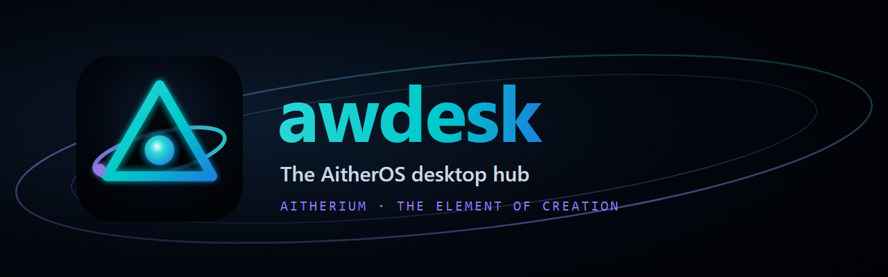

<p align="center">
  
</p>

<p align="center">
  The Aitherium desktop hub for AitherOS. The Element of Creation, on your desk.
</p>

---

awdesk is the desktop app that joins your machine to AitherOS. It puts your
agents on screen as VRM characters that speak with lip-sync, carries the Deck
where agents ask you to decide, and hosts the Aitheros Online living desktop
over or beside your real one. It works against aitherium.com or your own
local node, and it runs as a tray app with one console window (shown as
"Desk" in the taskbar and installer).

## What it does

- **Avatar presence.** VRM characters with amplitude lip-sync, driven by any
  supported app's voice output (WASAPI process loopback on Windows, PipeWire
  on Linux, a Core Audio process tap on macOS). Several agents can hold a body
  on the stage at once; the Stage pane moves, scales and arranges them.
- **The Deck.** The decision-card inbox (`~/.aither/decisions`). The tray
  badge and a native notification tell you when an agent needs you; ordinary
  cards are answered locally. Destructive cards (awstorage deletions,
  relocations and manage proposals) are approved with a passkey: Approve opens
  `api.aitherium.com/approve`, Windows Hello signs it, and awstorage only
  applies a signed answer. Rejecting never needs proof.
- **Living desktop.** AitherDesktop (the aitherium.com desktop) as its own
  window or drawn over your Windows desktop, one tray switch.
- **Voice.** Push-to-talk and open mic in, spoken replies out, through the
  awvoice tools on your AitherOS gateway. Every utterance passes a per-origin
  audibility gate and a content-rating gate.
- **Relay feed.** The `#agents` channel on AitherRelay and the local company
  room, in the Chat pane; a relay message can become a work order.
- **Console.** One window with detachable panes: Home, Decisions, Sessions,
  Chat, Command, Stage, Characters, Voices, Play, Fleet, Settings and
  AitherOS Online. Command turns a sentence into a session on the harness
  daemon; Fleet brings the local AitherOS fleet down and back up.
- **Cast and party.** `cast.json` decides who gets a body, which voice and
  where they stand; it syncs across your machines with `awsettings`. The
  party export writes the manifest other avatar products join on.
- **Agent control over MCP.** A loopback MCP server lets any agent play
  animations, switch characters, show or hide windows and report status.

## Install and run

Requirements: Node.js 24+, npm, and a desktop session with hardware graphics.
Windows is the primary target.

```bash
npm install
npm run dev          # Vite + Electron with hot reload
npm run demo         # build the renderer once and launch
npm start -- --background
```

The voice-output listener is a native helper. `npm run native:build` needs
Visual Studio Build Tools (C++ desktop workload); without them,
`npm run native:fetch` pulls the built helper from the newest release.

Packages (build on the OS you target; output goes to `release/`):

```bash
npm run dist:windows   # NSIS installer
npm run dist:linux     # AppImage and DEB
npm run dist:mac       # DMG and ZIP
```

The `dist:pg-*` variants strip adult-rated content (`.pgignore`) before
building the general-audience edition.

awdesk ships no character models. Enroll your own `.vrm` (tray: Characters >
Enroll newest Downloads .vrm, `install-model.ps1 <file>`, or the VRoid Hub
flow). Models live per user in `characters/<slug>/` and are never committed;
see [Asset licenses](ASSET_LICENSES.md).

## Configuration

Everything has a working default. The variables you are most likely to set:

| Variable | Default | Purpose |
| --- | --- | --- |
| `AITHER_PORTAL_ORIGIN` | `https://api.aitherium.com` | Where signed approvals open. https only (http allowed on loopback for development). |
| `AITHER_HARNESS_URL` | `http://127.0.0.1:8362` | The awdk harness daemon: sessions, the local room, Command. |
| `AITHER_HARNESS_TOKEN` | none | Bearer for the harness daemon when it requires one. |
| `AWDESK_GATEWAY_URL` | `http://127.0.0.1:8182` | Local AitherOS MCP gateway (voice, fleet, memory tools). |
| `AWDESK_OPS_BASE` | `https://api.aitherium.com` | Inference ops widget backend. |
| `AWDESK_VEIL_URL` | `https://aitherium.com` | Web app used for blog and editor links. |
| `LIVING_DESKTOP_URL` | `https://aitherium.com/` | The living desktop page. |
| `DESK_BRIDGE_PORT` | `47931` | Loopback bridge and MCP port. |
| `DESK_TARGET_PROCESS_PATTERN` | built-in list | Regex naming the voice app whose output drives lip-sync. |
| `AITHER_DECISIONS_DIR` | `~/.aither/decisions` | The decision-card store. |

## How it connects

- **aitherium.com** serves the living desktop and AitherDesktop.
- **api.aitherium.com** is the live web server: signed approvals and ops data.
- **Local node.** The AitherOS MCP gateway on `127.0.0.1:8182` for voice,
  fleet and memory tools; awdesk keeps working, with less, when it is down.
- **Harness daemon** (`127.0.0.1:8362`, from awdk) for sessions, the company
  room and Command. awsh and other agents reach awdesk through its MCP server:

```bash
claude mcp add --transport http desk http://127.0.0.1:47931/mcp
```

## Security model

- Renderer windows are context-isolated, sandboxed and have no Node.js
  integration; a strict content security policy applies, popups are denied
  and navigation off the local entry is blocked. The console window is the one
  named `sandbox: false` exception.
- The bridge binds `127.0.0.1` only, rejects non-loopback `Host` headers and
  limits bodies and origins. Its MCP tools are closed schemas: no command
  execution, no arbitrary file access.
- The approve window follows only the portal origin and https
  `*.aitherium.com`, its preload exposes nothing, and it keeps its sign-in in its own
  session partition. Whether a card needs a signed answer is decided from the
  card on disk, never from the renderer.
- Audio listeners compute a level in memory; nothing is recorded, transcribed
  or sent.

Details: [SECURITY.md](SECURITY.md).

## Development

```bash
node --test electron/*.test.cjs   # main-process tests
npm run test:renderer             # vitest (src/**/*.test.ts)
npm run check                     # lint, all tests, asset gate, audit, build
```

`build.appId` stays `com.xikhar.awdesk` on purpose. It keys the Windows
installer upgrade path and the notification identity (AUMID) of every existing
install; changing it would install awdesk side by side instead of upgrading.
For the same reason userData stays `%APPDATA%\Desk`.

More: [Architecture and development](docs/DEVELOPMENT.md) ·
[Integration API](docs/INTEGRATIONS.md) · [Releasing](docs/RELEASING.md)

## License and credits

Application source is MIT licensed; see [LICENSE](LICENSE). Character assets
are excluded from that license.

awdesk began as a fork of **Persona** by [xikhar](https://github.com/xikhar)
(`github.com/xikhar/persona`), a realtime character presence for desktop voice
apps. The avatar renderer, the
native audio listeners and the loopback bridge come from that project, and its
copyright notice is kept in the license.
